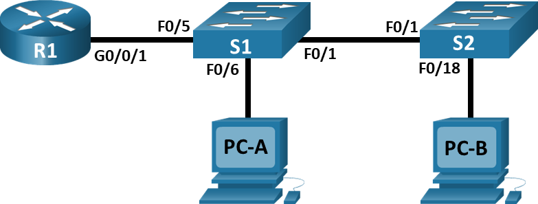
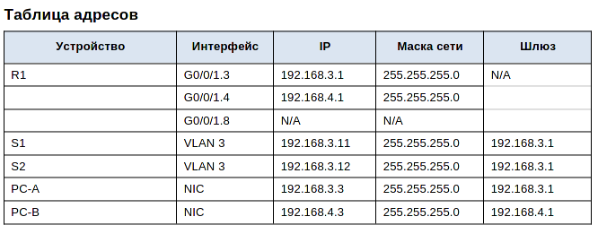
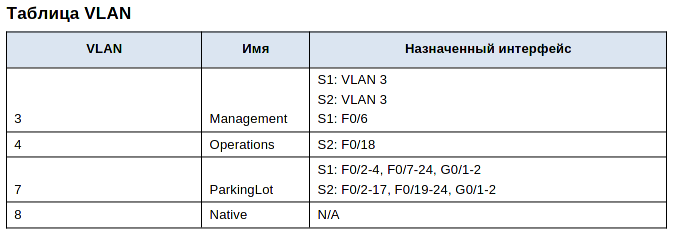
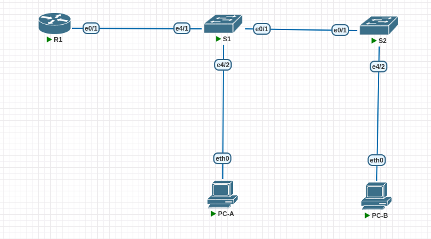
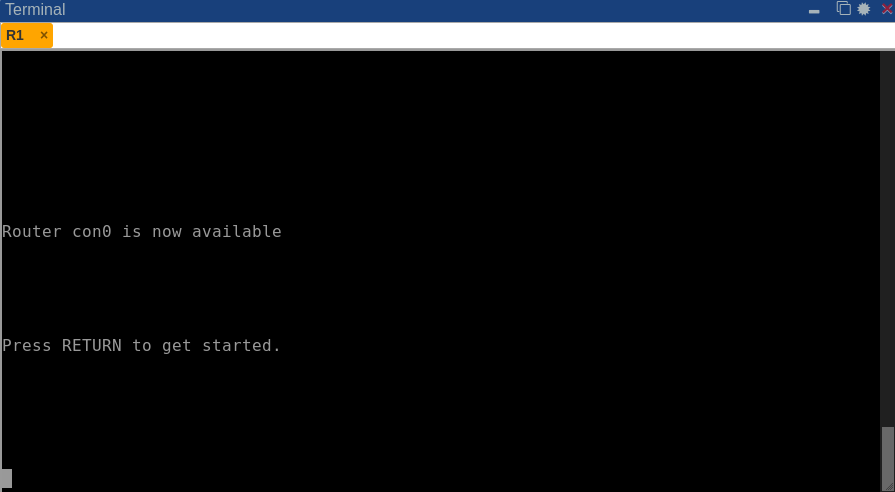

# Lab001 VLAN
##	 Конфигурация сегмента сети "роутер на палочке"
Исходное домашнее задание:
- внешний вид сети:


- исходная таблица адресов:
- 
- - исходная таблица VLAN:
-  
 
 ###  Часть задания №1
 Воссоздать сеть как указано в пункте "внешний вид сети", а также произвести базовую настройку устройств. Итак, приступим. Запустив PNETLab добавляем устройства на карту, а также линкуем их между собой. <b>Важно</b> именования портов, указанных в исходном ТЗ будут отличаться от фактического из-за особенностей ПО, но количественно - нет.
#### Шаг 1:
-  
#### Шаг 2:
- базовая настройка роутера. 
  
- Попадаем в привелигированный режим:
- `enable`
- Переходим в режим конфигурации:
- `conf`
- задаем имя устройства
- `hostname R1`
- Запрещаем DNS резолвинг командой:
- `no ip domain-lookup `
- Устанавливаем пароль на привелигированный режим:
- `enable password 12345`
- Устанавливаем пароль на вход в консоль
- `line con 0`
- `pass 12345`
- `login`
- - Устанавливаем пароль на вход в telnet
- `line vty  0 4`
- `pass 12345`
- `login`
- Шифруем пароли:
- `service password-encryption`
- Устанавливаем баннер:
- `banner motd «This is a secure system. Authorized Access Only!»`
- устанавливаем время
- `exit`
`clock set 19:35:00 13 apr 2023`
-Сохраняем конфигурацию:
`write`
#### шаг 3
Настраиваем коммутаторы(одинаково для S1 и S2):
`enable`
`conf`
Задаем имя для устройства (S1 и S2 соотв)
`hostname S1`
- Запрещаем DNS резолвинг командой:
- `no ip domain-lookup `
- Устанавливаем пароль на привелигированный режим:
- `enable password 12345`
- Устанавливаем пароль на вход в консоль
- `line con 0`
- `pass 12345`
- `login`
- - Устанавливаем пароль на вход в telnet
- `line vty  0 4`
- `pass 12345`
- `login`
- Шифруем пароли:
- `service password-encryption`
- Устанавливаем баннер:
- `banner motd «This is a secure system. Authorized Access Only!»`
- устанавливаем время
- `exit`
`clock set 19:40:00 13 apr 2023`
-Сохраняем конфигурацию:
`write`
#### Шаг 4
Настраиваем виртуальные PC. (A и B)
запускаем и  подключаемся к устройству. Настраиваем ip адрес и шлюз устройств командами:
PC A:
```
ip 192.168.3.3 255.255.255.0 192.168.3.1
set pcname PC-A
save
```
PC B: 
```
ip 192.168.4.3 255.255.255.0 192.168.4.1
set pcname PC-B
save
```
### Часть задания № 2
### Создание Vlan и назначение портов
#### Шаг 1 Создаем VLAN согласно заданию на коммутаторах 
Выполняем на коммутаторах S1 и S2:
- `vlan 3`
 `name management`
`vlan 7`
`name ParkingLot`
`vlan 4`
`name Operations`
На коммутаторе S2:
`vlan 4`
`name Operations`
`vlan 7`
`name ParkingLot`
Создаем управление на коммутаторе S1:
```
int vlan 3
ip add 192.168.3.11 255.255.255.0
no shu
```
Аналогично на коммутаторе S2:
```
int vlan 3
ip add 192.168.3.12 255.255.255.0
no shu
```
На обоих коммутаторах:
`ip route 0.0.0.0 0.0.0.0 192.168.3.1`

Далее, добавим все порты коммутаторов в Vlan "ParkingLot" на коммутаторах S1, S2. (потом, чтобы выйти на параметры домашнего задания, нужные порты вновь переделаем). А также выключим их (по условию задания)

```interface Ethernet0/0
switchport access vlan 7
shutdown
interface Ethernet0/1
switchport access vlan 7
shutdown
interface Ethernet0/2
switchport access vlan 7
shutdown
interface Ethernet0/3
switchport access vlan 7
shutdown
interface Ethernet1/0
switchport access vlan 7
shutdown
interface Ethernet1/1
switchport access vlan 7
shutdown
interface Ethernet1/2
switchport access vlan 7
shutdown
interface Ethernet1/3
switchport access vlan 7
shutdown
interface Ethernet2/0
switchport access vlan 7
shutdown
interface Ethernet2/1
switchport access vlan 7
shutdown
interface Ethernet2/2
switchport access vlan 7
shutdown
interface Ethernet2/3
switchport access vlan 7
shutdown
interface Ethernet3/0
switchport access vlan 7
shutdown
interface Ethernet3/1
switchport access vlan 7
shutdown
interface Ethernet3/2
switchport access vlan 7
shutdown
interface Ethernet3/3
switchport access vlan 7
shutdown
interface Ethernet4/0
switchport access vlan 7
shutdown
interface Ethernet4/1
switchport access vlan 7
shutdown
interface Ethernet4/2
switchport access vlan 7
shutdown
interface Ethernet4/3
switchport access vlan 7
shutdown
interface Ethernet5/0
switchport access vlan 7
shutdown
interface Ethernet5/1
switchport access vlan 7
shutdown
interface Ethernet5/2
switchport access vlan 7
shutdown
```
#### Шаг 2 Назначение access портов для других vlan
Настроим порт коммутатора S1, к которому подключен VPC (PC A). В моём случае это порт 1/2:
``` 
int eth 1/2
switchport access vlan 3
no shu
```
Аналогично - коммутатор S2 (там- порт 4/2):
```
int eth 4/2
switchport access vlan 4
no shu
```
### Часть 3 Конфигурирование  802.1Q Trunk между коммутаторами.
#### Шаг 1
Настроим trunk на интерфейсе 4/1 (в сторону роутера) а также добавим native vlan (коммутатор S1):
```
int eth 4/1
no switchport access vlan 7
switchport trunk encapsulation dot1q
switchport mode trunk
switchport nonegotiate
switchport trunk allowed vlan add 3,4
no shu
exit
vlan 8
name Native
exit
int eth 4/1
switchport trunk native vlan 8
```
Проделаем то же самое на коммутаторах S1 и S2 на портах 0/1:
```
int eth 0/1
no switchport access vlan 7
switchport trunk encapsulation dot1q
switchport mode trunk
switchport nonegotiate
switchport trunk allowed vlan add 3,4
no shu
exit
vlan 8
name Native
exit
int eth 0/1
switchport trunk native vlan 8
```
Вывод команды 
`show interfaces trunk`:

##### S1
```
S1#sho int tru

Port        Mode             Encapsulation  Status        Native vlan
Et0/1       on               802.1q         trunking      8
Et4/1       on               802.1q         trunking      8

Port        Vlans allowed on trunk
Et0/1       1-4094
Et4/1       1-4094

Port        Vlans allowed and active in management domain
Et0/1       1,3-4,7-8
Et4/1       1,3-4,7-8

Port        Vlans in spanning tree forwarding state and not pruned
Et0/1       1,3-4,7-8
Et4/1       1,3-4,7-8

```
##### S2
```
S2#sho int tru

Port        Mode             Encapsulation  Status        Native vlan
Et0/1       on               802.1q         trunking      8

Port        Vlans allowed on trunk
Et0/1       1-4094

Port        Vlans allowed and active in management domain
Et0/1       1,3-4,7-8

Port        Vlans in spanning tree forwarding state and not pruned
Et0/1       1,3-4,7-8
```

#### Шаг 2  
Настроим access порт на коммутаторе S2 для VPC (PC b):
```
int eth 4/2
switchport access vlan 4
no shu
```
### Часть 4 Настройка меж VLAN маршрутизации

НА роутере R1:
```
conf ter
int eth 0/1
no shu
int eth 0/1.3 
no shu
encapsulation dot1Q  3
ip addr 192.168.3.1 255.255.255.0

int eth 0/1.4
no shu
encapsulation dot1Q  4
ip addr 192.168.4.1 255.255.255.0
exit
```
Результат проверки настойки:
```
sho ip int bri
Interface                  IP-Address      OK? Method Status                Protocol
Ethernet0/0                unassigned      YES NVRAM  administratively down down    
Ethernet0/1                unassigned      YES NVRAM  up                    up      
Ethernet0/1.3              192.168.3.1     YES manual up                    up      
Ethernet0/1.4              192.168.4.1     YES manual up                    up      
Ethernet0/2                unassigned      YES NVRAM  administratively down down    
Ethernet0/3                unassigned      YES NVRAM  administratively down down
```

### Часть 5 Проверки
#### Шаг 1 
- Проверка доступности default gateway от PC-A:
```
PC-A> ping 192.168.3.1

84 bytes from 192.168.3.1 icmp_seq=1 ttl=255 time=0.971 ms
84 bytes from 192.168.3.1 icmp_seq=2 ttl=255 time=0.827 ms
84 bytes from 192.168.3.1 icmp_seq=3 ttl=255 time=0.938 ms
84 bytes from 192.168.3.1 icmp_seq=4 ttl=255 time=0.813 ms
84 bytes from 192.168.3.1 icmp_seq=5 ttl=255 time=0.983 ms
```
- Проверка доступности с PC-A до PC-B:
```
PC-A> ping 192.168.4.3

84 bytes from 192.168.4.3 icmp_seq=1 ttl=63 time=1.835 ms
84 bytes from 192.168.4.3 icmp_seq=2 ttl=63 time=1.531 ms
84 bytes from 192.168.4.3 icmp_seq=3 ttl=63 time=1.843 ms
84 bytes from 192.168.4.3 icmp_seq=4 ttl=63 time=1.850 ms
84 bytes from 192.168.4.3 icmp_seq=5 ttl=63 time=1.753 ms
```

- проверка доступности S2 от PC-A:
```
PC-A> ping 192.168.3.12

192.168.3.12 icmp_seq=1 timeout
84 bytes from 192.168.3.12 icmp_seq=2 ttl=255 time=0.909 ms
84 bytes from 192.168.3.12 icmp_seq=3 ttl=255 time=0.969 ms
84 bytes from 192.168.3.12 icmp_seq=4 ttl=255 time=1.013 ms
84 bytes from 192.168.3.12 icmp_seq=5 ttl=255 time=0.979 ms

```
#### Шаг 2
Трассировка пути от PC-B до PC-A:
```
PC-B> trace 192.168.3.3
trace to 192.168.3.3, 8 hops max, press Ctrl+C to stop
 1   192.168.4.1   1.063 ms  0.993 ms  0.741 ms
 2   *192.168.3.3   2.304 ms (ICMP type:3, code:3, Destination port unreachable)
```

### Добавлено (исправление от 17.04.2023)

Создание vlan interface и vlan native на роутере R1:

```
int eth 0/1.8
encapsulation dot1Q 8 native
```
