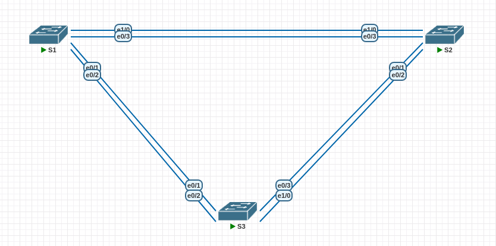
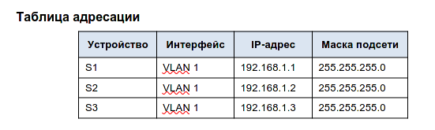

# Lab002 STP
##	 Конфигурация сегмента сети "Развертывание коммутируемой сети с резервными каналами"
Исходное домашнее задание:
- внешний вид сети:


- исходная таблица адресов:
- 

### Часть задания №1
#### Шаг 1:  
Произведем создание сети в системе pnetlab

#### Шаг 2
Запустим коммутаторы.
#### Шаг 3
Настраиваем коммутаторы(одинаково для S1,S2 и S3):
`enable`
`conf`
Задаем имя для устройства (S1S2,S3 соотв)
`hostname S1`
- Запрещаем DNS резолвинг командой:
- `no ip domain-lookup `
- Устанавливаем пароль на привелигированный режим:
- `enable password 12345`
- Устанавливаем пароль на вход в консоль
- `line con 0`
- `pass 12345`
- `login`
- - `logging synchronous`
- - Устанавливаем пароль на вход в telnet
- `line vty  0 4`
- `pass 12345`
- `login`
- Шифруем пароли:
- `service password-encryption`
- Устанавливаем баннер:
- `banner motd «This is a secure system. Authorized Access Only!»`
- Задаем ip адрес на устройствах (2 - S2, 3- S3 cоответственно):
```
int vlan 1
ip add 192.168.1.1 255.255.255.0
```
-Сохраняем конфигурацию:
`write`


----------------
#### Шаг 4
Проверяем связность с коммутатора S1 до коммутатора S2:
```
S1#ping 192.168.1.2
Type escape sequence to abort.
Sending 5, 100-byte ICMP Echos to 192.168.1.2, timeout is 2 seconds:
.!!!!
Success rate is 80 percent (4/5), round-trip min/avg/max = 1/1/1 ms
```
С коммутатора S1 до коммутатора S3:
```
S1#ping 192.168.1.3
Type escape sequence to abort.
Sending 5, 100-byte ICMP Echos to 192.168.1.3, timeout is 2 seconds:
.!!!!
Success rate is 80 percent (4/5), round-trip min/avg/max = 1/1/1 ms
```
С коммутатора S2 на коммутатор S3:
```
S2#ping 192.168.1.3
Type escape sequence to abort.
Sending 5, 100-byte ICMP Echos to 192.168.1.3, timeout is 2 seconds:
.!!!!
Success rate is 80 percent (4/5), round-trip min/avg/max = 1/1/1 ms
```

### Часть задания № 2
###  Определение корневого моста
#### Шаг 1 Отключим все порты на коммутаторах

Выполняем на коммутаторах S1,S2,S3:
```interface Ethernet0/0
shutdown
interface Ethernet0/1
shutdown
interface Ethernet0/2
shutdown
interface Ethernet0/3
shutdown
interface Ethernet1/0
shutdown
interface Ethernet1/1
shutdown
interface Ethernet1/2
shutdown
interface Ethernet1/3
shutdown
interface Ethernet2/0
shutdown
interface Ethernet2/1
shutdown
interface Ethernet2/2
shutdown
interface Ethernet2/3
shutdown
interface Ethernet3/0
shutdown
interface Ethernet3/1
shutdown
interface Ethernet3/2
shutdown
interface Ethernet3/3
shutdown
interface Ethernet4/0
shutdown
interface Ethernet4/1
shutdown
interface Ethernet4/2
shutdown
interface Ethernet4/3
shutdown
interface Ethernet5/0
shutdown
interface Ethernet5/1
shutdown
interface Ethernet5/2
shutdown
int eth 5/3
shutdown
```
#### Шаг 2.
Настраиваем транковые порты:
Коммутаторы S1,S2,S3(конфигурации портов совпадают):
```
int eth 0/1
switchport trunk encapsulation dot1q
switchport mode trunk
switchport nonegotiate
int eth 0/2
switchport trunk encapsulation dot1q
switchport mode trunk
switchport nonegotiate
int eth 0/3
switchport trunk encapsulation dot1q
switchport mode trunk
switchport nonegotiate
int eth 1/0
switchport trunk encapsulation dot1q
switchport mode trunk
switchport nonegotiate

```
#### Шаг 3 
Включаем линки между коммутаторами S1-S2 и S2-S3:
На S1:
```
int eth 0/1
no shu
int eth 1/0
no shu
``` 
На S2:
```
int eth 1/0
no shu
int eth 0/1
no shu
``` 
На S3:
```
int eth 0/1
no shu
int eth 0/3
no shu
``` 
#### Шаг 4
Выведем команду sho spa на всех коммутаторах:
```
S1#sho spa

VLAN0001
  Spanning tree enabled protocol ieee
  Root ID    Priority    32769
             Address     aabb.cc00.0100
             This bridge is the root
             Hello Time   2 sec  Max Age 20 sec  Forward Delay 15 sec

  Bridge ID  Priority    32769  (priority 32768 sys-id-ext 1)
             Address     aabb.cc00.0100
             Hello Time   2 sec  Max Age 20 sec  Forward Delay 15 sec
             Aging Time  15  sec

Interface           Role Sts Cost      Prio.Nbr Type
------------------- ---- --- --------- -------- --------------------------------
Et0/1               Desg FWD 100       128.2    P2p 
Et1/0               Desg FWD 100       128.5    P2p 


S2#sho spa

VLAN0001
  Spanning tree enabled protocol ieee
  Root ID    Priority    32769
             Address     aabb.cc00.0100
             Cost        100
             Port        5 (Ethernet1/0)
             Hello Time   2 sec  Max Age 20 sec  Forward Delay 15 sec

  Bridge ID  Priority    32769  (priority 32768 sys-id-ext 1)
             Address     aabb.cc00.0200
             Hello Time   2 sec  Max Age 20 sec  Forward Delay 15 sec
             Aging Time  15  sec

Interface           Role Sts Cost      Prio.Nbr Type
------------------- ---- --- --------- -------- --------------------------------
Et0/1               Desg FWD 100       128.2    P2p 
Et1/0               Root FWD 100       128.5    P2p


S3#sho spa

VLAN0001
  Spanning tree enabled protocol ieee
  Root ID    Priority    32769
             Address     aabb.cc00.0100
             Cost        100
             Port        2 (Ethernet0/1)
             Hello Time   2 sec  Max Age 20 sec  Forward Delay 15 sec

  Bridge ID  Priority    32769  (priority 32768 sys-id-ext 1)
             Address     aabb.cc00.0300
             Hello Time   2 sec  Max Age 20 sec  Forward Delay 15 sec
             Aging Time  15  sec

Interface           Role Sts Cost      Prio.Nbr Type
------------------- ---- --- --------- -------- --------------------------------
Et0/1               Root FWD 100       128.2    P2p 
Et0/3               Altn BLK 100       128.4    P2p 
```
- В моём случае коммутатор S1 оказался STP ROOT, т. к. он создавался в лабе первым и, соответственно, у него наименьший МАС на порту среди остальных коммутаторов.
- корневые порты: S2: Et1/0, S3: Et0/1
- заблокирован самый дальний линк от S1 (между S2 и S3): S3:Et0/3. Этот порт имеет наибольшую стоимость до root а также бОльший mac (относительно S2). Потому он и был заблокирован.

### Часть 3
### 1.  Наблюдение за процессом выбора протоколом STP порта, исходя из стоимости портов
#### Шаг 1
Определяем коммутатор с заблокированным портом. В моём случае это коммутатор S3
#### Шаг 2
Меняем стоимость stp на этом коммутаторе на порту, который "смотрит" в сторону root:
```
int eth 0/1
spanning-tree cost 18
```
- Далее проверяем состояние spanning tree:
```
S3#sho spa

VLAN0001
  Spanning tree enabled protocol ieee
  Root ID    Priority    32769
             Address     aabb.cc00.0100
             Cost        18
             Port        2 (Ethernet0/1)
             Hello Time   2 sec  Max Age 20 sec  Forward Delay 15 sec

  Bridge ID  Priority    32769  (priority 32768 sys-id-ext 1)
             Address     aabb.cc00.0300
             Hello Time   2 sec  Max Age 20 sec  Forward Delay 15 sec
             Aging Time  300 sec

Interface           Role Sts Cost      Prio.Nbr Type
------------------- ---- --- --------- -------- --------------------------------
Et0/1               Root FWD 18        128.2    P2p 
Et0/3               Desg FWD 100       128.4    P2p
```

Т. к. мы изменили стоимость линка, то протокол spanning tree произвёл перерассчет стоимости линков от root и заблокировал уже другой порт: Порт 0/1 на коммутаторе S2.


Меняем стоимость stp на этом же порту в исходное состояние:
```
int eth 0/1
no spanning-tree cost 18
```
Через какое-то время (после изучения) статусы портов вернулись в исходное состояние (порт 0/3, S3 заблокировался)
### Часть 4 Наблюдение за процессом выбора протоколом STP порта, исходя из приоритета портов
#### Шаг 1
Включим оставшиеся слинкованые порты коммутаторов:
На S1,S2:
```
int eth 0/2
no shu
int eth 0/3
no shu
``` 
На S3:
```
int eth 0/2
no shu
int eth 1/0
no shu
``` 
Выполним команду sho spa на некорневых коммутаторах (в моем случае S2, S3):

```
S2#sho spa

VLAN0001
  Spanning tree enabled protocol ieee
  Root ID    Priority    32769
             Address     aabb.cc00.0100
             Cost        100
             Port        4 (Ethernet0/3)
             Hello Time   2 sec  Max Age 20 sec  Forward Delay 15 sec

  Bridge ID  Priority    32769  (priority 32768 sys-id-ext 1)
             Address     aabb.cc00.0200
             Hello Time   2 sec  Max Age 20 sec  Forward Delay 15 sec
             Aging Time  300 sec

Interface           Role Sts Cost      Prio.Nbr Type
------------------- ---- --- --------- -------- --------------------------------
Et0/1               Desg FWD 100       128.2    P2p 
Et0/2               Desg FWD 100       128.3    P2p 
Et0/3               Root FWD 100       128.4    P2p 
Et1/0               Altn BLK 100       128.5    P2p 


S3#sho spa

VLAN0001
  Spanning tree enabled protocol ieee
  Root ID    Priority    32769
             Address     aabb.cc00.0100
             Cost        100
             Port        2 (Ethernet0/1)
             Hello Time   2 sec  Max Age 20 sec  Forward Delay 15 sec

  Bridge ID  Priority    32769  (priority 32768 sys-id-ext 1)
             Address     aabb.cc00.0300
             Hello Time   2 sec  Max Age 20 sec  Forward Delay 15 sec
             Aging Time  300 sec

Interface           Role Sts Cost      Prio.Nbr Type
------------------- ---- --- --------- -------- --------------------------------
Et0/1               Root FWD 100       128.2    P2p 
Et0/2               Altn BLK 100       128.3    P2p 
Et0/3               Altn BLK 100       128.4    P2p 
Et1/0               Altn BLK 100       128.5    P2p 

```

Как видим, порты корневого моста: S2 - Et0/3, S3 - Et0/1. Это порты выбраны в такое качестве, т. к. смотрят прямо на root коммутатор ну и имеют наикратчайший путь и наилучший cost!