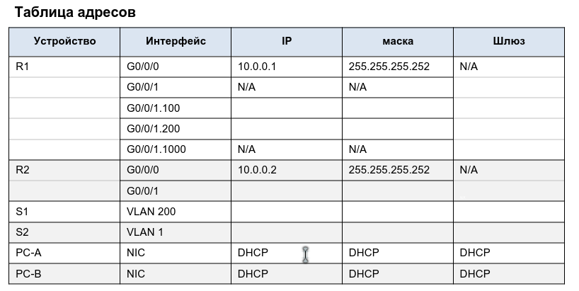
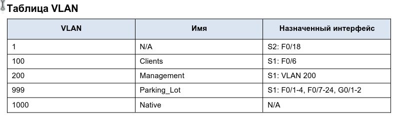
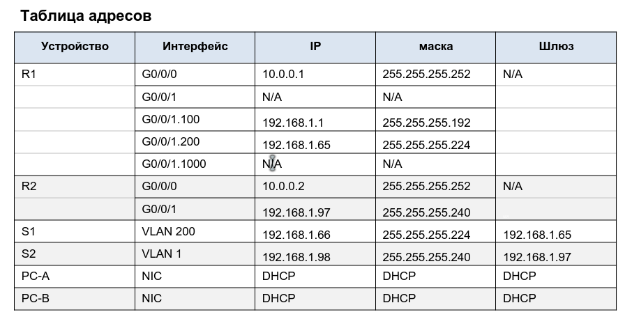
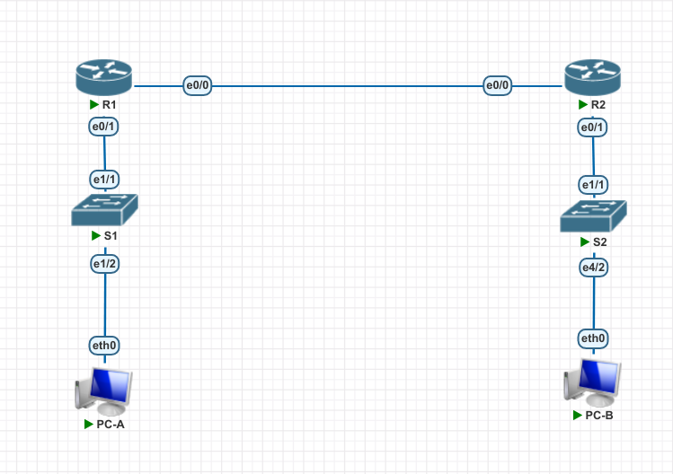

# Lab003 DHCP. V4,V6
##	 Конфигурация сегмента сети с использования сервиса автоконфигурации DHCP.

Исходное домашнее задание:
- внешний вид сети:


- исходная таблица адресов:
- 

- исходная таблица VLAN:
- 


### Часть задания №1
#### Шаг 1:  
Дозаполним таблицу адресного пространства согласно поставленным условиям.
Из того, что я понял: надо сеть /24 нарезать на 2 более мелких сети:
 - подсеть A - 58 хостов.
 -  подсеть B - 28 хостов (в т. ч. для управления R1)
 - подсеть С - 12 хостов (клиентская подсеть и управление R2).
 После процедуры разбиения сети на подсети наше адресное пространство выглядит так:
-  

#### Шаг 2:  
Произведем создание сети в системе pnetlab
- 
- 
#### Шаг 3
Запустим все устройства и произведём базовую настройку.
-   Запрещаем DNS резолвинг командой:
-   `no ip domain-lookup`
-   Устанавливаем пароль на привелигированный режим:
-   `enable password 12345`
-   Устанавливаем пароль на вход в консоль
-   `line con 0`
-   `pass 12345`
-   `login`
-   -   Устанавливаем пароль на вход в telnet
-   `line vty 0 4`
-   `pass 12345`
-   `login`
-   Шифруем пароли:
-   `service password-encryption`
-   Устанавливаем баннер:
-   `banner motd «This is a secure system. Authorized Access Only!»`
- -Сохраняем конфигурацию:  `write`
Т.к. данную процедуру нужно будет одинаково повторить на еще 3 устройствах, вынесем команды в отдельный файл:  <i>startup.basic.part.conf</i> после чего, команды оттуда можно копировать в консоль telnet для дальнейшей автоконфигурации.
Останется только задать уникальный hostname.
...
Итак, R1,R2,S1,S2 (базовые настройки) - завершены.
#### Шаг 4 
Настройка межвлановой маршрутизации на роутере R1:
```
int eth 0/0
no shu
ip add 10.0.0.1 255.255.255.252
no shu

int eth 0/1
no shu
int eth 0/1.100
encapsulation dot1Q 100
ip add 192.168.1.1 255.255.255.192
no shu

int eth 0/1.200
encapsulation dot1Q 200
ip add 192.168.1.65 255.255.255.224
no shu

int eth 0/1.1000
encapsulation dot1Q 1000 native
no shu
```
Настроили на порту 0/1 - соответствующие vlan, создали vlan interface и настроили адресацию.
Проверяем работу интерфейсов:
```
R1>ping 192.168.1.65
Type escape sequence to abort.
Sending 5, 100-byte ICMP Echos to 192.168.1.65, timeout is 2 seconds:
!!!!!
Success rate is 100 percent (5/5), round-trip min/avg/max = 4/4/5 ms
R1>ping 192.168.1.1 
Type escape sequence to abort.
Sending 5, 100-byte ICMP Echos to 192.168.1.1, timeout is 2 seconds:
!!!!!
Success rate is 100 percent (5/5), round-trip min/avg/max = 4/4/5 ms
```
#### Шаг 5.
Настройка межвлановой маршрутизации на роутере R2:

```
int eth 0/0
no shu
ip add 10.0.0.2 255.255.255.252
no shu

int eth 0/1
no shu
ip add 192.168.1.97 255.255.255.192
no shu
```
Добавим маршрут по умолчанию (На R2):
```
ip route 0.0.0.0 0.0.0.0 10.0.0.1
ip routing
```
А также на R1: 
Добавим маршрут по умолчанию:
```
ip route 0.0.0.0 0.0.0.0 10.0.0.2
ip routing
```
проверяем доступность Ip адреса клиентской сети R2 с роутера R1:
```
R1#ping 192.168.1.97
Type escape sequence to abort.
Sending 5, 100-byte ICMP Echos to 192.168.1.97, timeout is 2 seconds:
!!!!!
Success rate is 100 percent (5/5), round-trip min/avg/max = 1/1/1 ms
```
работает.

#### Шаг 6 
Базовая настройка Коммутаторов S1, S2. Этот пункт мы сделали сразу, еще когда настраивали роутеры R1, R2 :)
#### Шаг 7
Создаём Управление на коммутаторе S1:
```
vlan 200
name Management
no shu
int vla 200
ip add 192.168.1.66 255.255.255.224
no shu
exit 
ip route 0.0.0.0 0.0.0.0 192.168.1.65
```
Настраиваем порты на коммутаторе S1:
```
int eth 1/1
switchport trunk encapsulation dot1q
description to_R1_trunk
switchport mode trunk
switchport trunk allowed vlan add 100,200

int eth 1/2
switchport mode access
switchport access vlan 200
no shu 
desc to_PC-A
```
А также неиспользуемые порты "паркуем" в vlan999:
```
vlan 999
name Parking_Lot
interface Ethernet0/0
switchport access vlan 999
shu
interface Ethernet0/1
switchport access vlan 999
shu
interface Ethernet0/2
switchport access vlan 999
shu
interface Ethernet0/3
switchport access vlan 999
shu
interface Ethernet1/0
switchport access vlan 999
shu
interface Ethernet1/3
switchport access vlan 999
shu
interface Ethernet2/0
switchport access vlan 999
shu
interface Ethernet2/1
switchport access vlan 999
shu
interface Ethernet2/2
switchport access vlan 999
shu
interface Ethernet2/3
switchport access vlan 999
shu
interface Ethernet3/0
switchport access vlan 999
shu
interface Ethernet3/1
switchport access vlan 999
shu
interface Ethernet3/2
switchport access vlan 999
shu
interface Ethernet3/3
switchport access vlan 999
shu
interface Ethernet4/0
switchport access vlan 999
shu
interface Ethernet4/1
switchport access vlan 999
shu
interface Ethernet4/2
switchport access vlan 999
shu
interface Ethernet4/3
switchport access vlan 999
shu
interface Ethernet5/0
switchport access vlan 999
shu
interface Ethernet5/1
switchport access vlan 999
shu
interface Ethernet5/2
switchport access vlan 999
shu
interface Ethernet5/3
switchport access vlan 999
shu
```

Создаём Управление на коммутаторе S2:
```
int vla 1
ip add 192.168.1.98 255.255.255.240
no shu
exit 
ip route 0.0.0.0 0.0.0.0 192.168.1.97
```
#### Шаг 8
Назначение портов для соответствующих vlan. Частично это уже было сделано выше. Но доведем до конца:

```
vlan 100
name Clients
int eth 1/2
switchport access vlan 100
int eth 1/1
switchport trunk allowed vlan add 100
```
#### Шаг 9
Настройка транкового линка между S1-R1 (со стороны S1):
Частично я уже сделал это выше. Но теперь еще надо добавить native vlan:
```
vlan 1000
name Native
int eth 1/1
switchport trunk native vlan 1000
```
Уф, наконец дошли до DHCP :)
### Часть 2 Конфигурация и проверка DHCPv4 Servers на R1
#### Шаг 1
Настроим R1 DHCPv4 пул для двух подсетей:
```
ip dhcp pool ClientsS1
network 192.168.1.0 255.255.255.192
default-router 192.168.1.1
dns-server 192.168.1.1
domain-name ccna-lab.com
lease 2 12 30
exit 
ip dhcp excluded-address 192.168.1.1

ip dhcp pool ClientsS2
network 192.168.1.96 255.255.255.240
default-router 192.168.1.97
dns-server 192.168.1.1
lease 2 12 30
exit
ip dhcp excluded-address 192.168.1.97
```
Настроим DHCPv4 Relay на R2:
```

```
#### Шаг 2
на всех устройствах сохраним конфигурацию:
```
wri
```
А потом еще раз, чтобы уже наверняка.

#### Шаг 3
Проверим конфигурацию сервера DHCPv4
R1:
```
R1#show ip dhcp pool

Pool ClientsS1 :
 Utilization mark (high/low)    : 100 / 0
 Subnet size (first/next)       : 0 / 0 
 Total addresses                : 62
 Leased addresses               : 0
 Pending event                  : none
 1 subnet is currently in the pool :
 Current index        IP address range                    Leased addresses
 192.168.1.1          192.168.1.1      - 192.168.1.62      0

Pool Management :
 Utilization mark (high/low)    : 100 / 0
 Subnet size (first/next)       : 0 / 0 
 Total addresses                : 30
 Leased addresses               : 0
 Pending event                  : none
 1 subnet is currently in the pool :
 Current index        IP address range                    Leased addresses
 192.168.1.65         192.168.1.65     - 192.168.1.94      0


R1#sho ip dhcp binding 
Bindings from all pools not associated with VRF:
IP address          Client-ID/	 	    Lease expiration        Type
		    Hardware address/
		    User name


R1#sho ip dhcp server statistics 
Memory usage         25776
Address pools        2
Database agents      0
Automatic bindings   0
Manual bindings      0
Expired bindings     0
Malformed messages   0
Secure arp entries   0

Message              Received
BOOTREQUEST          0
DHCPDISCOVER         0
DHCPREQUEST          0
DHCPDECLINE          0
DHCPRELEASE          0
DHCPINFORM           0

Message              Sent
BOOTREPLY            0
DHCPOFFER            0
DHCPACK              0
DHCPNAK              0
```
#### Шаг 4
Запускаем нашу VPC (A). Настраиваем:
```
set pcname PC-A
dhcp 
DDORA IP 192.168.1.4/26 GW 192.168.1.1
save
```
Получили по DHCP IP. Ok.
Пингуем шлюз:
```
PC-A> ping 192.168.1.1

84 bytes from 192.168.1.1 icmp_seq=1 ttl=255 time=0.287 ms
84 bytes from 192.168.1.1 icmp_seq=2 ttl=255 time=0.807 ms
84 bytes from 192.168.1.1 icmp_seq=3 ttl=255 time=0.760 ms
84 bytes from 192.168.1.1 icmp_seq=4 ttl=255 time=0.707 ms
84 bytes from 192.168.1.1 icmp_seq=5 ttl=255 time=0.803 ms

```
### Часть 3 Конфигурация DHCP Relay на роутере R2

#### Шаг 1
Настройка DHCP relay на роутере R2:
```
int eth 0/1
ip helper-address 10.0.0.1
```
#### Шаг 2
Запускаем и настраиваем PC-B

```
set pcname PC-B
dhcp
DDORA IP 192.168.1.99/28 GW 192.168.1.97
save
```
Ок. Проверяем связность:
```
PC-B> ping 192.168.1.1

84 bytes from 192.168.1.1 icmp_seq=1 ttl=254 time=0.979 ms
84 bytes from 192.168.1.1 icmp_seq=2 ttl=254 time=1.253 ms
84 bytes from 192.168.1.1 icmp_seq=3 ttl=254 time=1.031 ms
84 bytes from 192.168.1.1 icmp_seq=4 ttl=254 time=0.926 ms
84 bytes from 192.168.1.1 icmp_seq=5 ttl=254 time=1.093 ms

PC-B> ping 192.168.1.4

84 bytes from 192.168.1.4 icmp_seq=1 ttl=62 time=2.635 ms
84 bytes from 192.168.1.4 icmp_seq=2 ttl=62 time=1.677 ms
84 bytes from 192.168.1.4 icmp_seq=3 ttl=62 time=1.425 ms
84 bytes from 192.168.1.4 icmp_seq=4 ttl=62 time=1.464 ms
84 bytes from 192.168.1.4 icmp_seq=5 ttl=62 time=1.349 ms
```

Смотрим результат команды  <b>show ip dhcp binding </b> На R1:
```
R1#sho ip dhcp bind
Bindings from all pools not associated with VRF:
IP address          Client-ID/	 	    Lease expiration        Type
		    Hardware address/
		    User name
192.168.1.4         0100.5079.6668.22       Apr 24 2023 12:24 AM    Automatic
192.168.1.99        0100.5079.6668.23       Apr 24 2023 01:56 AM    Automatic
```
Смотрим результат команды  <b> ip dhcp server stat</b>
```
R1#sho ip dhcp server statistics 
Memory usage         42581
Address pools        2
Database agents      0
Automatic bindings   2
Manual bindings      0
Expired bindings     0
Malformed messages   0
Secure arp entries   0

Message              Received
BOOTREQUEST          0
DHCPDISCOVER         4
DHCPREQUEST          2
DHCPDECLINE          0
DHCPRELEASE          0
DHCPINFORM           0

Message              Sent
BOOTREPLY            0
DHCPOFFER            2
DHCPACK              2
DHCPNAK              0
```
На этом часть лабораторной работы (DHCP v4) завершена. 
Далее, будет реализация DHCP v6.
