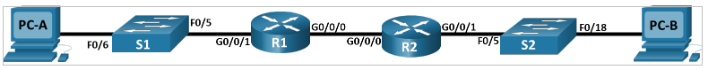
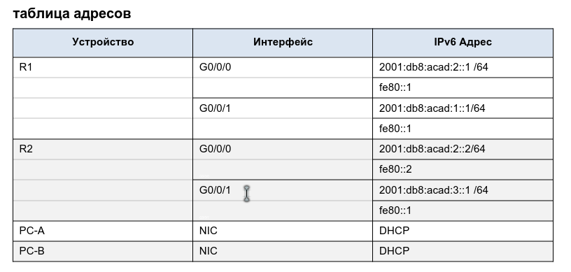
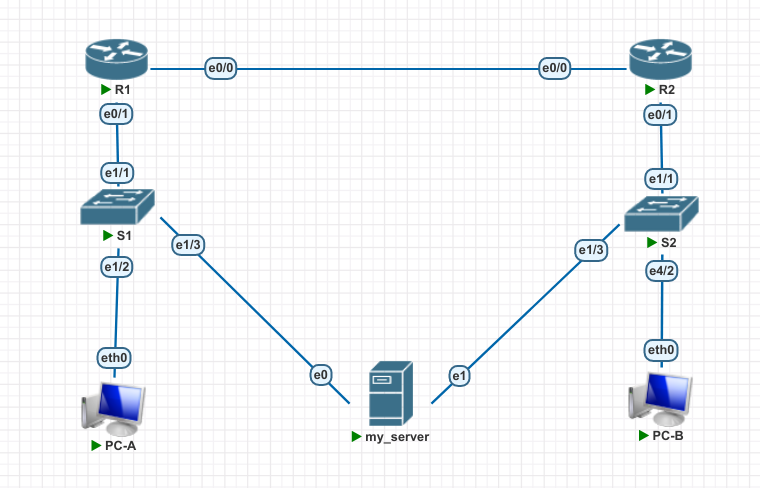
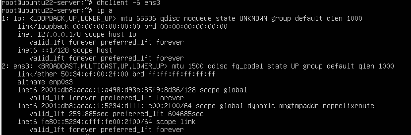
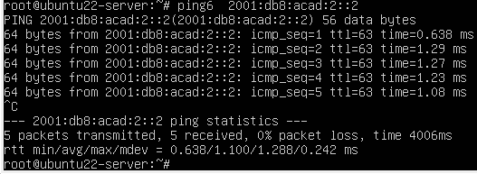
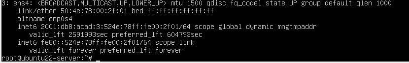
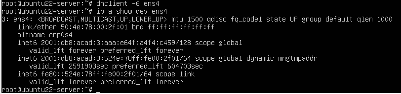

# Lab003 DHCP. V4,V6
##	 Конфигурация сегмента сети с использования сервиса автоконфигурации DHCP.

Исходное домашнее задание:
- внешний вид сети:


- исходная таблица адресов:
- 


### Часть задания №1
#### Шаг 1:  
Произведем создание сети в системе pnetlab
- 
#### Шаг 2,3:
Произведем базовую настройку узлов сети: S1,R1,S2,R2.  Абсолютно идентичный шаг 1 части лабы (dhcp v4). Использую для этого также готовый кусок конфига из файла <i>startup.basic.part.config</i>, а так же зададим hostname каждому устройству.

#### Шаг 4:
Сконфигурируем на роутерах R1 и R2 IP адреса согласно техзаданию.
R1:
```
int eth 0/0
ipv6 add 2001:db8:acad:2::1/64
ipv6 address fe80::1 link-local
no shu

int eth 0/1
ipv6 add 2001:db8:acad:1::1/64
ipv6 address fe80::1 link-local
no shu
exit 
ipv6 route ::0/0 2001:db8:acad:2::2
ipv6 unicast-routing
```

R2:
```
int eth 0/0
ipv6 add 2001:db8:acad:2::2/64
ipv6 address fe80::2 link-local
no shu
int eth 0/1
ipv6 add 2001:db8:acad:3::1/64
ipv6 address fe80::1 link-local
no shu
exit 
ipv6 route ::0/0 2001:db8:acad:2::1
ipv6 unicast-routing
```
Проверка связности с R1 до R2:
```
R1#ping ipv6 2001:db8:acad:2::2
Type escape sequence to abort.
Sending 5, 100-byte ICMP Echos to 2001:DB8:ACAD:2::2, timeout is 2 seconds:
!!!!!
Success rate is 100 percent (5/5), round-trip min/avg/max = 1/1/1 ms
```
 Проверка связности с R2 до R1:
 ```
 R2#ping ipv6 2001:db8:acad:1::1
Type escape sequence to abort.
Sending 5, 100-byte ICMP Echos to 2001:DB8:ACAD:1::1, timeout is 2 seconds:
!!!!!
Success rate is 100 percent (5/5), round-trip min/avg/max = 1/1/1 ms
 ```

### Часть задания №2
Включим PC-A .
Зададим имя и сохраним конфигурацию:
```
set pcname PC-A
save
```
Посмотрим, какие адреса получил наш хост:
```
show

NAME   IP/MASK              GATEWAY                             GATEWAY
PC-A   0.0.0.0/0            0.0.0.0
       fe80::250:79ff:fe66:6829/64
       2001:db8:acad:1:2050:79ff:fe66:6829/64 eui-64

```
### Часть 3 Конфигурирование и проверка DHCPv6 сервер на R1
#### Шаг 1
Просмотр полной конфигурации IPv6 на PC-A:
```
PC-A> show ipv6 all

NAME   IP/MASK                                 ROUTER LINK-LAYER  MTU
PC-A   fe80::250:79ff:fe66:6829/64
       2001:db8:acad:1:2050:79ff:fe66:6829/64  aa:bb:cc:00:01:10  1500

```
#### Шаг 2
- Настройка ipv6 DHCP на роутере R1 (statless). Создадим базовые настройки DHCP:
```
ipv6 dhcp pool R1-STATELESS
dns-server 2001:db8:acad::254
domain-name STATELESS.com
```
- Сконфигурируем порт (в сторону S1) для DHCPv6
```
int eth 0/1
ipv6 nd other-config-flag
ipv6 dhcp server R1-STATELESS
exit
exit
wri
```
- Перезапустим PC-A
И..... В этот моменте возникла сложность. Я не увидел поддержки со стороны Pnetlab и образа для virtualPC поддержки dhcp v6.
Поэтому в лабу я добавить виртуальный server ubuntu 22.04 с двумя сетевыми интерфейсами. 
Для того, чтобы проверить работу системы DHCPv6 
- 
- Я запустил сервер, проверил что он получает ipv6 адрес по SLAAC, а потом выполнил команду:
```
dhclient -6 ens3
```
где - ens3 - имя сетевого интерфейса, подключенного к коммутатору S1
- 
- В итоге устройство получило 2 ipv6 адреса.
проверяем связность (пингуем R2):
-
### Часть 4 Конфигурация  stateful DHCPv6 server на R1

```
ipv6 dhcp pool R2-STATEFUL
address prefix 2001:db8:acad:3:aaa::/80
dns-server 2001:db8:acad::254
domain-name STATEFUL.com
int eth 0/0
ipv6 dhcp server R2-STATEFUL
```

### Часть 5. Конфигурация и проверка DHCPv6 релея на R2

#### Шаг 1
Включу второй ip интерфейс на сервере my_server:
```
ip l set up dev ens4
```
Результат:  


-

#### Шаг2 
Настроим на R2 DHCPv6 relay:
```
int eth 0/1
ipv6 nd managed-config-flag
ipv6 dhcp relay destination 2001:db8:acad:2::1 eth0/0
exit
exit
wri
```
#### Шаг 3
Запросим адрес на устройстве my_server на 2 сетевой карте, которая "смотрит" в сторону S2:
-
- Адреса получили, все работает!


