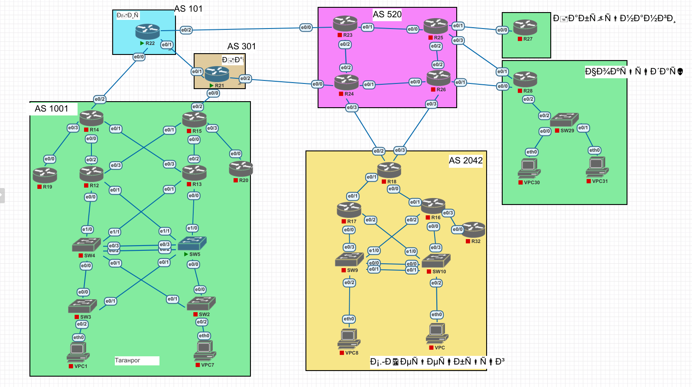

# Lab011 Архитектура сети. 

# Исходное домашнее задание:
- внешний вид сети:


## Поставленные задачи
- Разработать и задокументировать адресное пространство для лабораторного стенда.
- Настроить ip адреса на каждом активном порту
- Настроить каждый VPC в каждом офисе в своем VLAN.
- Настроить VLAN/Loopbackup interface управления для сетевых устройств
- Настроить сети офисов так, чтобы не возникало broadcast штормов, а использование линков было максимально оптимизировано

#### Небольшая аннотация.
из-за разниц кодировок моя сеть в первоначальном виде выглядела так:

А потому я переименовал объекты в свои. Если это будет критично далее - переименую обратно, если сообщите как-то оригинальные названия :)

### Выполнение задания
Я разделил (для удобства отображения) предложенную карту сети на 3 части.
На карте обозначено:
- Красным цветом:  адреса, назначаемые на loopback интерфейсов роутеров (кроме коммутаторов). Для коммутаторов - IP в VLAN управления (vlan 200)
- Зеленым цветом обозначены IP адреса L3 peer to peer линки между роутерами.
- Черным - IP адреса клиентов (VPC*)

#### Часть 1: Таганрог:


#### Часть 2: Ростов


#### Часть 3: Остальное.


#### Конфигурации оборудования.
Готовые конфигурации оборудования были экспортированы в папку configs

Итак, на все роутеры были назначены loopback IP адреса командой:
```
int loo 0 
ip add <ip_addr> <mask>
```
Далее, на роутерах, на каждом линке был поднят IP с сеткой /30:
```
int eth <number>/<number>
ip add <ip_addr> <subnet>
no shu
```
Далее,  в сторону коммутаторов (L2): на роутерах была выбрата прошивка IRON, где есть поддержка VLAN, spanning-tree.
На эти роутерах помимо IP интерфейсов были подняты VRRP (для резервирования default gateway), а также поднят spanning tree (pvst). при это L3 роутеры были назначены как primary root и secondary root.

На парах коммутатором SW4 и SW5,а также на паре sw9, sw10 которые соеденены двумя L2 линками, для повышения эффективности использования линков был поднят LACP (channel group 1)

 
