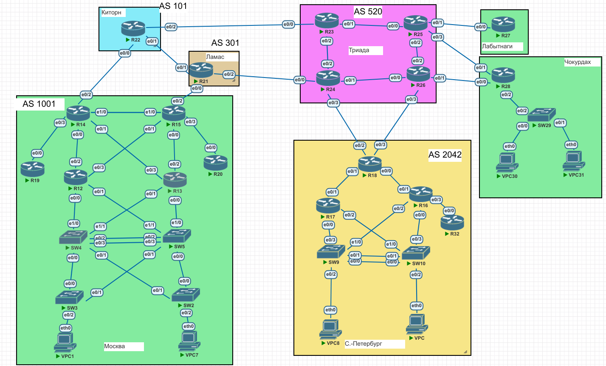

# Lab012 PBR.
# Исходное домашнее задание:
- внешний вид сети:


## Поставленные задачи
- Настроите политику маршрутизации для сетей офиса.
- Распределите трафик между двумя линками с провайдером.
- Настроите отслеживание линка через технологию IP SLA.(только для IPv4)
- Настройте для офиса Лабытнанги маршрут по-умолчанию.
- План работы и изменения зафиксированы в документации .

### Выполнение задания

Итак, начнем с того, что обеспечим во всех офисах IP связность.
Сами IP адреса были выставлены на интерфейсах еще в предыдущей лабе. Поэтому, текущая задача сводиться лишь к настройке маршрутизации между узлами. Т. к.  в ДЗ явно не указан предпочтительный способ настройки, то я буду использовать то, что мне удобнее. Поэтому... я выбрал протокол OSPF.
Лабытнаги:
 Между роутерами R25 и R27 подниму area 27 stub - так "прилетит" на R27 default и задача будет выполнена. Аналогично в Чокурдах. Только там - зона 28 stub.
 
 На R27:
```
router ospf 1
 router-id 172.16.0.30
 area 27 stub
 network 172.16.0.28 0.0.0.3 area 27
```

На R25: 
```
router ospf 1
 router-id 10.5.2.25
 area 27 stub
 area 28 stub
 network 172.16.0.28 0.0.0.3 area 27
 network 172.16.0.32 0.0.0.3 area 28
```

проверяем таблицу маршрутизации на R27:
```
R27#sho ip ro
Codes: L - local, C - connected, S - static, R - RIP, M - mobile, B - BGP
       D - EIGRP, EX - EIGRP external, O - OSPF, IA - OSPF inter area 
       N1 - OSPF NSSA external type 1, N2 - OSPF NSSA external type 2
       E1 - OSPF external type 1, E2 - OSPF external type 2
       i - IS-IS, su - IS-IS summary, L1 - IS-IS level-1, L2 - IS-IS level-2
       ia - IS-IS inter area, * - candidate default, U - per-user static route
       o - ODR, P - periodic downloaded static route, H - NHRP, l - LISP
       a - application route
       + - replicated route, % - next hop override

Gateway of last resort is 172.16.0.29 to network 0.0.0.0

O*IA  0.0.0.0/0 [110/11] via 172.16.0.29, 21:50:26, Ethernet0/0
      10.0.0.0/8 is variably subnetted, 8 subnets, 2 masks
O IA     10.5.2.23/32 [110/21] via 172.16.0.29, 21:50:26, Ethernet0/0
O IA     10.5.2.24/32 [110/31] via 172.16.0.29, 21:50:26, Ethernet0/0
O IA     10.5.2.25/32 [110/11] via 172.16.0.29, 21:50:26, Ethernet0/0
O IA     10.5.2.26/32 [110/21] via 172.16.0.29, 00:00:26, Ethernet0/0
O IA     10.5.2.48/30 [110/30] via 172.16.0.29, 21:50:26, Ethernet0/0
O IA     10.5.2.52/30 [110/20] via 172.16.0.29, 21:50:26, Ethernet0/0
O IA     10.5.2.56/30 [110/20] via 172.16.0.29, 00:00:21, Ethernet0/0
O IA     10.5.2.60/30 [110/30] via 172.16.0.29, 00:00:26, Ethernet0/0
      172.16.0.0/16 is variably subnetted, 4 subnets, 2 masks
C        172.16.0.28/30 is directly connected, Ethernet0/0
L        172.16.0.30/32 is directly connected, Ethernet0/0
O IA     172.16.0.32/30 [110/20] via 172.16.0.29, 21:50:26, Ethernet0/0
O IA     172.16.0.36/30 [110/30] via 172.16.0.29, 21:50:26, Ethernet0/0
O IA  192.168.28.0/24 [110/30] via 172.16.0.29, 21:50:26, Ethernet0/0
```
Видим, что прилетело много всего (что не противоречит домашнему заданию) и в т. ч. 
default gateway.

Настраиваем R28 (Чокурдах):

```
router ospf 1
 router-id 172.16.0.38
 area 28 stub
 network 172.16.0.32 0.0.0.3 area 28
 network 172.16.0.36 0.0.0.3 area 28
 network 192.168.28.0 0.0.0.255 area 28
 maximum-paths 2
```
на R26:
```
router ospf 1
 router-id 10.5.2.26
 area 28 stub
 network 172.16.0.36 0.0.0.3 area 28
```

Смотрим таблицу маршрутизации на R28:
```
R28#sho ip ro
Codes: L - local, C - connected, S - static, R - RIP, M - mobile, B - BGP
       D - EIGRP, EX - EIGRP external, O - OSPF, IA - OSPF inter area 
       N1 - OSPF NSSA external type 1, N2 - OSPF NSSA external type 2
       E1 - OSPF external type 1, E2 - OSPF external type 2
       i - IS-IS, su - IS-IS summary, L1 - IS-IS level-1, L2 - IS-IS level-2
       ia - IS-IS inter area, * - candidate default, U - per-user static route
       o - ODR, P - periodic downloaded static route, H - NHRP, l - LISP
       a - application route
       + - replicated route, % - next hop override

Gateway of last resort is 172.16.0.33 to network 0.0.0.0

S*    0.0.0.0/0 [1/0] via 172.16.0.33
      10.0.0.0/8 is variably subnetted, 8 subnets, 2 masks
O IA     10.5.2.23/32 [110/21] via 172.16.0.33, 02:47:46, Ethernet0/1
O IA     10.5.2.24/32 [110/21] via 172.16.0.37, 02:47:46, Ethernet0/0
O IA     10.5.2.25/32 [110/11] via 172.16.0.33, 02:47:46, Ethernet0/1
O IA     10.5.2.26/32 [110/11] via 172.16.0.37, 02:47:46, Ethernet0/0
O IA     10.5.2.48/30 [110/30] via 172.16.0.37, 02:47:46, Ethernet0/0
                      [110/30] via 172.16.0.33, 02:47:46, Ethernet0/1
O IA     10.5.2.52/30 [110/20] via 172.16.0.33, 02:47:46, Ethernet0/1
O IA     10.5.2.56/30 [110/20] via 172.16.0.37, 00:05:06, Ethernet0/0
                      [110/20] via 172.16.0.33, 00:05:06, Ethernet0/1
O IA     10.5.2.60/30 [110/20] via 172.16.0.37, 02:47:46, Ethernet0/0
      172.16.0.0/16 is variably subnetted, 5 subnets, 2 masks
O IA     172.16.0.28/30 [110/20] via 172.16.0.33, 02:47:46, Ethernet0/1
C        172.16.0.32/30 is directly connected, Ethernet0/1
L        172.16.0.34/32 is directly connected, Ethernet0/1
C        172.16.0.36/30 is directly connected, Ethernet0/0
L        172.16.0.38/32 is directly connected, Ethernet0/0
      192.168.28.0/24 is variably subnetted, 2 subnets, 2 masks
C        192.168.28.0/24 is directly connected, Ethernet0/2.100
L        192.168.28.1/32 is directly connected, Ethernet0/2.100
```
Т. е. default gateway - присутствует. 
также, для обеспечения связности, Сети Чокурдах и Лабутнаги были добавлены в iBGP на R25 и R26.

#### распределение трафика между двумя линками с провайдером. v1 (ospf based)

на роутере R28 включаем ECMP:
```
router ospf 1
 maximum-paths 2
```
Смотрим на таблицу маршрутизации:

 ```
 R28#sho ip ro
Codes: L - local, C - connected, S - static, R - RIP, M - mobile, B - BGP
       D - EIGRP, EX - EIGRP external, O - OSPF, IA - OSPF inter area 
       N1 - OSPF NSSA external type 1, N2 - OSPF NSSA external type 2
       E1 - OSPF external type 1, E2 - OSPF external type 2
       i - IS-IS, su - IS-IS summary, L1 - IS-IS level-1, L2 - IS-IS level-2
       ia - IS-IS inter area, * - candidate default, U - per-user static route
       o - ODR, P - periodic downloaded static route, H - NHRP, l - LISP
       a - application route
       + - replicated route, % - next hop override

Gateway of last resort is 172.16.0.37 to network 0.0.0.0

O*IA  0.0.0.0/0 [110/11] via 172.16.0.37, 00:10:55, Ethernet0/0
                [110/11] via 172.16.0.33, 00:10:55, Ethernet0/1
      10.0.0.0/8 is variably subnetted, 8 subnets, 2 masks
O IA     10.5.2.23/32 [110/21] via 172.16.0.33, 00:26:44, Ethernet0/1
O IA     10.5.2.24/32 [110/21] via 172.16.0.37, 00:45:34, Ethernet0/0
O IA     10.5.2.25/32 [110/11] via 172.16.0.33, 00:26:44, Ethernet0/1
O IA     10.5.2.26/32 [110/11] via 172.16.0.37, 00:45:34, Ethernet0/0
O IA     10.5.2.48/30 [110/30] via 172.16.0.37, 00:45:34, Ethernet0/0
                      [110/30] via 172.16.0.33, 00:26:44, Ethernet0/1
O IA     10.5.2.52/30 [110/20] via 172.16.0.33, 00:26:44, Ethernet0/1
O IA     10.5.2.56/30 [110/20] via 172.16.0.37, 00:45:34, Ethernet0/0
                      [110/20] via 172.16.0.33, 00:26:44, Ethernet0/1
O IA     10.5.2.60/30 [110/20] via 172.16.0.37, 00:45:34, Ethernet0/0
      172.16.0.0/16 is variably subnetted, 5 subnets, 2 masks
O IA     172.16.0.28/30 [110/20] via 172.16.0.33, 00:26:44, Ethernet0/1
C        172.16.0.32/30 is directly connected, Ethernet0/1
L        172.16.0.34/32 is directly connected, Ethernet0/1
C        172.16.0.36/30 is directly connected, Ethernet0/0
L        172.16.0.38/32 is directly connected, Ethernet0/0
      192.168.28.0/24 is variably subnetted, 2 subnets, 2 masks
C        192.168.28.0/24 is directly connected, Ethernet0/2.100
L        192.168.28.1/32 is directly connected, Ethernet0/2.100
```

 Видим, что для маршрута по умолчанию включился механизм ECMP и трафик будет распределяться по двум линкам. Задача выполнена.

#### распределение трафика между двумя линками с провайдером. v2 (PBR based)

Итак, теперь настроим балансировку трафика с помощью политик.
На роутере R28 создалдим правило:
```
route-map balancer permit 10
 match ip address odd
 set ip next-hop verify-availability 172.16.0.37 1 track 1
!
route-map balancer permit 20
 match ip address even
 set ip next-hop verify-availability 172.16.0.33 2 track 2
```

Тут мы указали, что для четных IP направлять трафик по одному пути, для нечетных - по другому. Но это не всё!
Также нужно создать и соответствующие acces lists:
```
ip access-list standard even
 permit 192.168.28.0 0.0.0.254
ip access-list standard odd
 permit 192.168.28.1 0.0.0.254
```

Далее. На случай, если у нас 1 провайдер "упадёт" - нужно оставшийся трафик перенаправлять на рабочий. Для этого создадим правила SLA,  с помощью которых будем отслеживать состояния вышестоящих IP (gateways):

```
ip sla 2
 icmp-echo 172.16.0.37 source-interface Ethernet0/0
 frequency 5
ip sla schedule 2 life forever start-time now
ip sla 3
 icmp-echo 172.16.0.33 source-interface Ethernet0/1
 frequency 5
ip sla schedule 3 life forever start-time now

track 1 ip sla 2 reachability
 delay down 10 up 5
!
track 2 ip sla 3 reachability
 delay down 10 up 5

``` 
также добавим маршруты:

```
ip route 0.0.0.0 0.0.0.0 172.16.0.37 track 1
ip route 0.0.0.0 0.0.0.0 172.16.0.33 track 2
```

Смотрим на состояние политики:

```
R28#sho route-map balancer
route-map balancer, permit, sequence 10
  Match clauses:
    ip address (access-lists): odd 
  Set clauses:
    ip next-hop verify-availability 172.16.0.37 1 track 1  [up]
  Policy routing matches: 10 packets, 980 bytes
route-map balancer, permit, sequence 20
  Match clauses:
    ip address (access-lists): even 
  Set clauses:
    ip next-hop verify-availability 172.16.0.33 2 track 2  [up]
  Policy routing matches: 0 packets, 0 bytes

```

Видим, что SLA работает, оба провадера в состоянии UP.

Теперь проверяем работу нашего балансера:
Идём на узел VCP30 и запускаем:
```
VPC30> trace 192.168.1.6
trace to 192.168.1.6, 8 hops max, press Ctrl+C to stop
 1   192.168.28.1   0.238 ms  0.284 ms  0.252 ms
 2   172.16.0.37   0.395 ms  0.304 ms  0.354 ms
 3   10.5.2.57   0.403 ms  0.347 ms  0.331 ms
 4   10.5.2.53   0.455 ms  0.407 ms  0.337 ms
 5   172.16.0.5   0.552 ms  0.492 ms  0.529 ms
 6   172.16.0.1   0.640 ms  0.570 ms  0.583 ms
 7   10.0.1.133   0.723 ms  0.694 ms  0.691 ms
 8   *192.168.1.6   2.191 ms (ICMP type:3, code:3, Destination port unreachable)
```

```
VPC30> trace 192.168.1.6
trace to 192.168.1.6, 8 hops max, press Ctrl+C to stop
 1   192.168.28.1   0.238 ms  0.284 ms  0.252 ms
 2   172.16.0.37   0.395 ms  0.304 ms  0.354 ms
 3   10.5.2.57   0.403 ms  0.347 ms  0.331 ms
 4   10.5.2.53   0.455 ms  0.407 ms  0.337 ms
 5   172.16.0.5   0.552 ms  0.492 ms  0.529 ms
 6   172.16.0.1   0.640 ms  0.570 ms  0.583 ms
 7   10.0.1.133   0.723 ms  0.694 ms  0.691 ms
 8   *192.168.1.6   2.191 ms (ICMP type:3, code:3, Destination port unreachable)
```
Видим, что на разные узлы (четные, нечетные) трафик ходит по разным путям. Задача - выполнена.

#### Настроика отслеживания линка через технологию IP SLA
  
Я выбрал для отслеживания линка - "условный сервер" в Москве, который представлен в лабораторной работе как VPC1 и у меня имеет адрес 192.168.1.5,а отслеживать его (по ICMP)  буду из устройства R28. Настройка (на R28):
```
ip sla 1
 icmp-echo 192.168.1.5 source-ip 192.168.28.1
 frequency 10
ip sla schedule 1 life forever start-time now
```
Задача выполнена.

#### Настройка для офиса Лабытнанги маршрут по-умолчанию

Ну тут я уже выше написал что реализовал задачу постерством OSPF area 27 stub. Конечно. можно было бы просто указать 
```
ip route 0.0.0.0 0.0.0.0 <ip_R25>
```
Но это было бы слишком просто! Я чуть усложнил себе задачу, но к конечному результату всеравно пришёл.

#### Конфигурации оборудования.
Готовые конфигурации оборудования были экспортированы в папку configs


