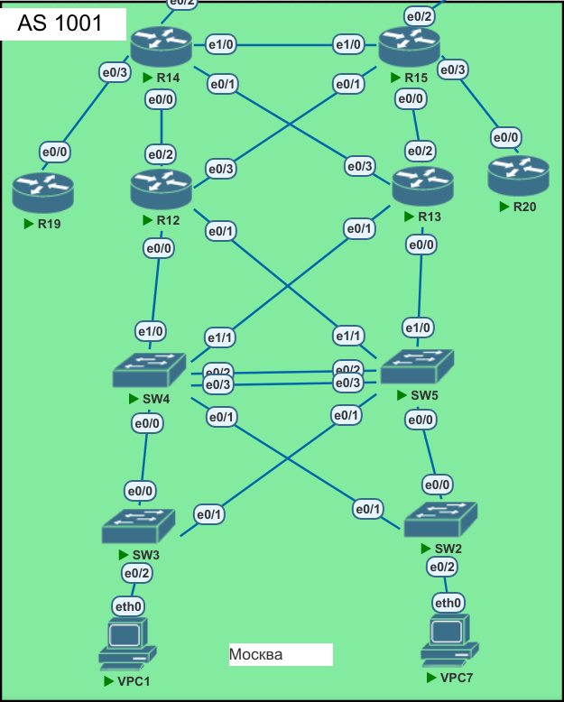

# Lab011 Архитектура сети. 

# Исходное домашнее задание:
- внешний вид сети(рассматриваемый в данной лабе фрагмент):


## Поставленные задачи
1. Маршрутизаторы R14-R15 находятся в зоне 0 - backbone.
2. Маршрутизаторы R12-R13 находятся в зоне 10. Дополнительно к маршрутам должны получать маршрут по умолчанию.
3. Маршрутизатор R19 находится в зоне 101 и получает только маршрут по умолчанию.
4. Маршрутизатор R20 находится в зоне 102 и получает все маршруты, кроме маршрутов до сетей зоны 101.
5. Настройка для IPv6 повторяет логику IPv4.
6. План работы и изменения зафиксированы в документации .

### Выполнение задания
Начнем настраивать OSPF:
ВАЖНЫЙ МОМЕНТ!
На L3 коммутаторах, которые соединены только с другими L3 коммутаторами я принял решение делать L3 линки (т. е. peer to peer).  Поэтому, чтобы area0 не была разорвана между коммутаторами R14 и R15 - я протянул дополнительный линк. (Альтернативно можно было переделать на L2 линки и протянуть vlan, но я решил, что такой вариант - менее правильный.)
R14: 
```
router ospf 1
router-id 10.0.1.14
 area 10 nssa default-information-originate
 area 101 stub no-summary
 passive-interface default
 no passive-interface Ethernet0/0
 no passive-interface Ethernet0/1
 no passive-interface Ethernet0/3
 no passive-interface Ethernet1/0
 network 10.0.1.14 0.0.0.0 area 0
 network 10.0.1.128 0.0.0.3 area 101
 network 10.0.1.132 0.0.0.3 area 10
 network 10.0.1.144 0.0.0.3 area 10
 network 10.0.1.152 0.0.0.3 area 0
```
Т. к. по условиях исходного домашнего задания на роутеры R12, R13 нужно "подать" default route и прочие маршруты - я решил сделать эту зону (10) - nssa.


Итак:
- зашли в меню настройки OSPF
-   назначили router-id (взяв за основу адрес lo)
-  выключили глобально прохождение пакето hello ospf (в целях безопасности)
- разрешили работу ospf на порт 0/0
- добавили нужные сети в процесс ospf.
- указал тип area
 
Далее, принципиально то же самое сделаем для других роутеров:

R15: 
```
router ospf 1
router-id 10.0.1.14
 area 10 nssa default-information-originate
 area 101 stub no-summary
 passive-interface default
 no passive-interface Ethernet0/0
 no passive-interface Ethernet0/1
 no passive-interface Ethernet0/3
 no passive-interface Ethernet1/0
 network 10.0.1.14 0.0.0.0 area 0
 network 10.0.1.128 0.0.0.3 area 101
 network 10.0.1.132 0.0.0.3 area 10
 network 10.0.1.144 0.0.0.3 area 10
 network 10.0.1.152 0.0.0.3 area 0
```

R12: 
```
router ospf 1
 router-id 10.0.1.133
 area 10 nssa
 passive-interface default
 no passive-interface Ethernet0/2
 no passive-interface Ethernet0/3
 no passive-interface Vlan200
```

далее, согласно ТЗ  R12 и R13 нужно добавить в зону 10:
R12: 
```
network 10.0.1.132 0.0.0.3 area 10
 network 10.0.1.148 0.0.0.3 area 10
 network 10.0.2.0 0.0.0.127 area 10
```
R13:
```
 router-id 10.0.1.20
 area 10 nssa
 passive-interface default
 no passive-interface Ethernet0/0
 no passive-interface Ethernet0/1
 no passive-interface Ethernet0/2
 no passive-interface Ethernet0/3
 no passive-interface Loopback0
 no passive-interface Vlan200
 network 10.0.1.20 0.0.0.0 area 10
 network 10.0.1.136 0.0.0.3 area 10
 network 10.0.1.144 0.0.0.3 area 10
 network 10.0.2.0 0.0.0.127 area 10
```
Т.е.  поднимем зону 10 через существующий vlan200, который протянут между роутерами R12 и R13.

далее.  Добавим R19 в свою зону 101. Для этого зону 101 также нужно сделать и на R14
R14:
```
no passive-interface ethernet 0/3
network 10.10.1.130 0.0.0.3 area 101
```
R19:
```
router ospf 1
 router-id 10.0.1.19
 passive-interface default
 no passive-interface Ethernet0/0
 network 10.0.1.19 0.0.0.0 area 101
 network 10.0.1.128 0.0.0.3 area 101
```
Далее. Чтобы  получить на других роутерах информацию о default gateway
(я выбрал R14) На R14 надо его (default route)
проанонсить командой:
```
router ospf 1
default-information originate
```

Далее, имеет смысл роутер R19 с отдельной зоной 101, убрать в зону типа stub:
R14:
```
 area 101 stub no-summary
```
R19:
```
area 101 stub
```
теперь, на роутере R19 мы получаем только default route: 
```
R19#sho ip ospf rou

            OSPF Router with ID (10.0.1.19) (Process ID 1)


Base Topology (MTID 0)


    Area 101

    Intra-area Route List
*   10.0.1.128/30, Intra, cost 10, area 101, Connected
      via 10.0.1.129, Ethernet0/0
*   10.0.1.19/32, Intra, cost 1, area 101, Connected
      via 10.0.1.19, Loopback0

    Intra-area Router Path List
i 10.0.1.14 [10] via 10.0.1.130, Ethernet0/0, ABR, Area 101, SPF 9

    Inter-area Route List
*>  0.0.0.0/0, Inter, cost 11, area 101
      via 10.0.1.130, Ethernet0/0
	  
```

Далее. Поработаем с R20:
```
router ospf 1
router-id 10.0.1.20
 passive-interface default
 no passive-interface Ethernet0/0
 network 10.0.1.20 0.0.0.0 area 102
 network 10.0.1.140 0.0.0.3 area 102
```
Далее, нужно выполнитьусловие домашнего задания и зафильтровать на роутер R20 маршруты из 101 зоны.  Для этого создадим правило фильтрации и применим его на роутере R15:

```
ip prefix-list area102 seq 5 deny 10.0.1.128/30
ip prefix-list area102 seq 10 deny 10.0.1.19/32
ip prefix-list area102 seq 11 deny 0.0.0.0/0
ip prefix-list area102 seq 15 permit 0.0.0.0/0 le 32
```
Потом  - применим этот prefix-list:
```
router ospf 1
 area 102 filter-list prefix area102 in
```
В итоге на роутер R20 не будут попадать маршруты из зоны 101:

```
sho ip ro
Codes: L - local, C - connected, S - static, R - RIP, M - mobile, B - BGP
       D - EIGRP, EX - EIGRP external, O - OSPF, IA - OSPF inter area 
       N1 - OSPF NSSA external type 1, N2 - OSPF NSSA external type 2
       E1 - OSPF external type 1, E2 - OSPF external type 2
       i - IS-IS, su - IS-IS summary, L1 - IS-IS level-1, L2 - IS-IS level-2
       ia - IS-IS inter area, * - candidate default, U - per-user static route
       o - ODR, P - periodic downloaded static route, H - NHRP, l - LISP
       a - application route
       + - replicated route, % - next hop override

Gateway of last resort is not set

      10.0.0.0/8 is variably subnetted, 10 subnets, 3 masks
O IA     10.0.1.14/32 [110/21] via 10.0.1.142, 01:02:16, Ethernet0/0
C        10.0.1.20/32 is directly connected, Loopback0
O IA     10.0.1.132/30 [110/30] via 10.0.1.142, 00:35:20, Ethernet0/0
O IA     10.0.1.136/30 [110/20] via 10.0.1.142, 01:03:25, Ethernet0/0
C        10.0.1.140/30 is directly connected, Ethernet0/0
L        10.0.1.141/32 is directly connected, Ethernet0/0
O IA     10.0.1.144/30 [110/30] via 10.0.1.142, 00:34:22, Ethernet0/0
O IA     10.0.1.148/30 [110/20] via 10.0.1.142, 00:56:40, Ethernet0/0
O IA     10.0.1.152/30 [110/20] via 10.0.1.142, 01:03:25, Ethernet0/0
O IA     10.0.2.0/25 [110/21] via 10.0.1.142, 00:33:42, Ethernet0/0
```
также приведу таблицу маршрутизации для других роутеров:
R19 (stub no-summary):
```
#sho ip ro
Codes: L - local, C - connected, S - static, R - RIP, M - mobile, B - BGP
       D - EIGRP, EX - EIGRP external, O - OSPF, IA - OSPF inter area 
       N1 - OSPF NSSA external type 1, N2 - OSPF NSSA external type 2
       E1 - OSPF external type 1, E2 - OSPF external type 2
       i - IS-IS, su - IS-IS summary, L1 - IS-IS level-1, L2 - IS-IS level-2
       ia - IS-IS inter area, * - candidate default, U - per-user static route
       o - ODR, P - periodic downloaded static route, H - NHRP, l - LISP
       a - application route
       + - replicated route, % - next hop override

Gateway of last resort is 10.0.1.130 to network 0.0.0.0

O*IA  0.0.0.0/0 [110/11] via 10.0.1.130, 04:23:20, Ethernet0/0
      10.0.0.0/8 is variably subnetted, 3 subnets, 2 masks
C        10.0.1.19/32 is directly connected, Loopback0
C        10.0.1.128/30 is directly connected, Ethernet0/0
L        10.0.1.129/32 is directly connected, Ethernet0/0
```
R14(area0): 

```
sho ip ro
Codes: L - local, C - connected, S - static, R - RIP, M - mobile, B - BGP
       D - EIGRP, EX - EIGRP external, O - OSPF, IA - OSPF inter area 
       N1 - OSPF NSSA external type 1, N2 - OSPF NSSA external type 2
       E1 - OSPF external type 1, E2 - OSPF external type 2
       i - IS-IS, su - IS-IS summary, L1 - IS-IS level-1, L2 - IS-IS level-2
       ia - IS-IS inter area, * - candidate default, U - per-user static route
       o - ODR, P - periodic downloaded static route, H - NHRP, l - LISP
       a - application route
       + - replicated route, % - next hop override

Gateway of last resort is 172.16.0.2 to network 0.0.0.0

S*    0.0.0.0/0 [1/0] via 172.16.0.2
      10.0.0.0/8 is variably subnetted, 15 subnets, 3 masks
C        10.0.1.14/32 is directly connected, Loopback0
O        10.0.1.19/32 [110/11] via 10.0.1.129, 00:38:29, Ethernet0/3
O        10.0.1.20/32 [110/11] via 10.0.1.145, 00:36:08, Ethernet0/1
C        10.0.1.128/30 is directly connected, Ethernet0/3
L        10.0.1.130/32 is directly connected, Ethernet0/3
C        10.0.1.132/30 is directly connected, Ethernet0/0
L        10.0.1.134/32 is directly connected, Ethernet0/0
O        10.0.1.136/30 [110/20] via 10.0.1.145, 00:34:56, Ethernet0/1
O IA     10.0.1.140/30 [110/20] via 10.0.1.154, 00:38:29, Ethernet1/0
C        10.0.1.144/30 is directly connected, Ethernet0/1
L        10.0.1.146/32 is directly connected, Ethernet0/1
O        10.0.1.148/30 [110/20] via 10.0.1.133, 00:37:17, Ethernet0/0
C        10.0.1.152/30 is directly connected, Ethernet1/0
L        10.0.1.153/32 is directly connected, Ethernet1/0
O        10.0.2.0/25 [110/11] via 10.0.1.145, 00:36:08, Ethernet0/1
                     [110/11] via 10.0.1.133, 00:37:17, Ethernet0/0
      172.16.0.0/16 is variably subnetted, 2 subnets, 2 masks
C        172.16.0.0/30 is directly connected, Ethernet0/2
L        172.16.0.1/32 is directly connected, Ethernet0/2
```
#### Конфигурации оборудования.
Готовые конфигурации оборудования были экспортированы в папку configs


