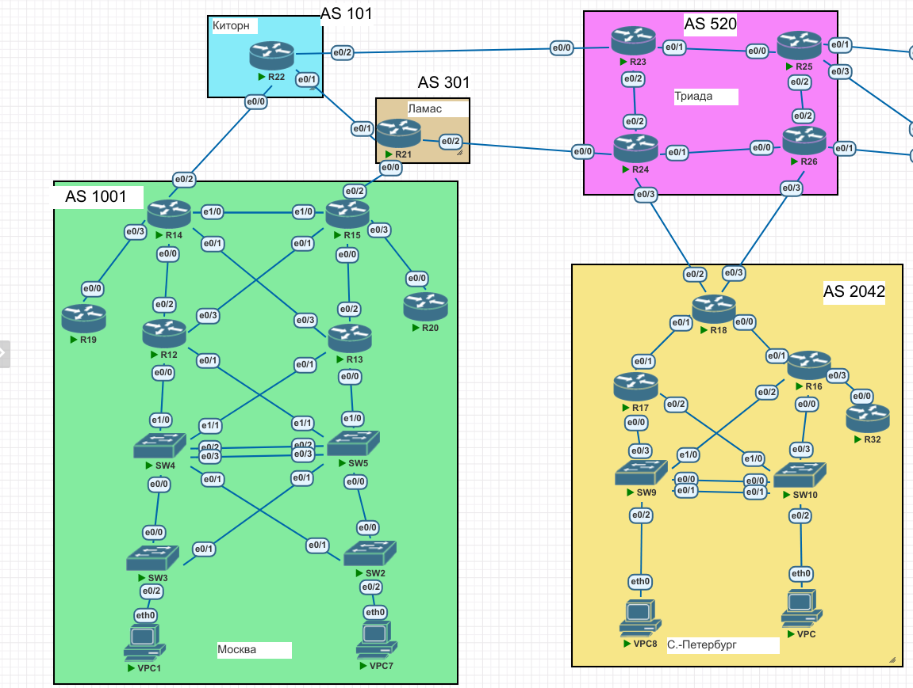

# Lab025 Основы BGP. 

# Исходное домашнее задание:
- внешний вид сети(рассматриваемый в данной лабе фрагмент):


## Поставленные задачи
1. Настроите eBGP между офисом Москва и двумя провайдерами - Киторн и Ламас.
2. Настроите eBGP между провайдерами Киторн и Ламас.
3. Настроите eBGP между Ламас и Триада.
4. Настроите eBGP между офисом С.-Петербург и провайдером Триада.
5. Организуете IP доступность между пограничным роутерами офисами Москва и С.-Петербург.

### Выполнение задания
Начнем настраивать BGP. Начну с роутера  c R14:
```
router bgp 1001
 bgp router-id 10.0.1.14
 network 10.0.1.0 mask 255.255.255.0
 network 10.0.2.0 mask 255.255.255.0
 network 192.168.1.0
 neighbor 10.0.1.15 remote-as 1001
 neighbor 10.0.1.15 update-source Loopback0
 neighbor 172.16.0.2 remote-as 101
```
Итак. Я сделал:
1. назначил явно router-id для процесса BGP.
2. добавил в анонсы сети, которые присутствуют в моей AS. Причем, добавил только "полезные" сети: управления устройствами (адреса Lo) и пользовательские сети (где есть ПК). Сети P2P в анонсы не добавлял. 
Чтобы корректно проанонсились в BGP указанные сети, я создал доп статические маршруты:
```
ip route 10.0.1.0 255.255.255.0 Null0
ip route 10.0.2.0 255.255.255.0 Null0
```
3. Добавил соседей для участия в работе пиринга BGP. В моем случае это: R15 и R22
Важный момент: внутри одной AS я поднял сессию между Lo адресами роутеров.
Чтобы сессия поднялась, нужно, что src пакетов соответсовал Lo. Для этого добавлена команда:
```
 neighbor 10.0.1.15 update-source Loopback0
```
####
Аналогично произведём настройку на роутере R15:
```
router bgp 1001
 bgp router-id 10.0.1.15
 network 10.0.1.0 mask 255.255.255.0
 network 10.0.2.0 mask 255.255.255.0
 network 192.168.1.0
 neighbor 10.0.1.14 remote-as 1001
 neighbor 10.0.1.14 update-source Loopback0
 neighbor 172.16.0.14 remote-as 301
 
ip route 10.0.1.0 255.255.255.0 Null0
ip route 10.0.2.0 255.255.255.0 Null0
```
Далее, настроим BGP на R22 (Киторн):
```
router bgp 101
 network 10.1.0.22 mask 255.255.255.255
 network 172.16.0.4 mask 255.255.255.252
 network 172.16.0.8 mask 255.255.255.252
 neighbor 172.16.0.1 remote-as 1001
 neighbor 172.16.0.6 remote-as 520
 neighbor 172.16.0.10 remote-as 301
```
Т. к.  Киторн - совсем маленькая AS, то тут можно уже проанонсить прям не сети, а конкретные IP этого роутера. 

Далее на очереди - Ламас (R21):
```
router bgp 301
 bgp log-neighbor-changes
 network 10.3.0.21 mask 255.255.255.255
 neighbor 172.16.0.9 remote-as 101
 neighbor 172.16.0.13 remote-as 1001
 neighbor 172.16.0.18 remote-as 520
```
Теперь - нужно настроить все 4 роутера в AS "Триада":
- R23:
```
router bgp 520
 network 10.5.2.0 mask 255.255.255.0
 neighbor 10.5.2.26 remote-as 520
 neighbor 10.5.2.26 update-source Loopback0
 neighbor 10.5.2.49 remote-as 520
 neighbor 10.5.2.54 remote-as 520
 neighbor 172.16.0.5 remote-as 101
 
 ip route 10.5.2.0 255.255.255.0 Null0
```
тут мы поднимаем сессии между всеми пограничными маршрутизаторами в пределах своей AS, а также с роутером и Киторне (R22). также - анонсим "в мир" только сеть управления триады. Для этого и добавляем static route. 
Далее. R24:
```
router bgp 520
 network 10.5.2.0 mask 255.255.255.0
 neighbor 10.5.2.25 remote-as 520
 neighbor 10.5.2.25 update-source Loopback0
 neighbor 10.5.2.50 remote-as 520
 neighbor 10.5.2.62 remote-as 520
 neighbor 172.16.0.17 remote-as 301
 neighbor 172.16.0.22 remote-as 2042
 
 ip route 10.5.2.0 255.255.255.0 Null0
```
R25:
```
router bgp 520
 neighbor 10.5.2.24 remote-as 520
 neighbor 10.5.2.24 update-source Loopback0
 neighbor 10.5.2.53 remote-as 520
 neighbor 10.5.2.58 remote-as 520
 
 ip route 10.5.2.0 255.255.255.0 Null0
```
R26: 
```
router bgp 520
 bgp router-id 10.5.20.26
 bgp log-neighbor-changes
 neighbor 10.5.2.23 remote-as 520
 neighbor 10.5.2.23 update-source Loopback0
 neighbor 10.5.2.57 remote-as 520
 neighbor 10.5.2.61 remote-as 520
 neighbor 172.16.0.26 remote-as 2042
 
ip route 10.5.2.0 255.255.255.0 Null0
```
На триаде настройка BGP (в рамках требований ДЗ) - завершена.

Теперь настроим BGP в Питере:
R18:
```
router bgp 2042
 network 10.20.42.0 mask 255.255.255.0
 neighbor 172.16.0.21 remote-as 520
 neighbor 172.16.0.25 remote-as 520
 
 ip route 10.20.42.0 255.255.255.0 Null0
```
На этом основная часть работы - закончена:
ping R18 -> R14
```
R18#ping 10.0.1.14 source loo 0
Type escape sequence to abort.
Sending 5, 100-byte ICMP Echos to 10.0.1.14, timeout is 2 seconds:
Packet sent with a source address of 10.20.42.18 
!!!!!
Success rate is 100 percent (5/5), round-trip min/avg/max = 1/1/1 ms
```
ping R15 -> R18:
```
R15#ping 10.20.42.18 source loo 0
Type escape sequence to abort.
Sending 5, 100-byte ICMP Echos to 10.20.42.18, timeout is 2 seconds:
Packet sent with a source address of 10.0.1.15 
!!!!!
Success rate is 100 percent (5/5), round-trip min/avg/max = 1/1/2 ms
```


#### Конфигурации оборудования.
Готовые конфигурации оборудования были экспортированы в папку configs


