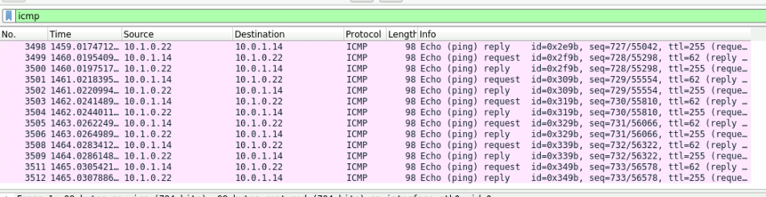

# Lab033 Основные протоколы сети интернет

# Исходное домашнее задание:
- внешний вид сети(рассматриваемый в данной лабе фрагмент):


## Поставленные задачи
1. Настроите NAT(PAT) на R14 и R15. Трансляция должна осуществляться в адрес автономной системы AS1001.
2. Настроите NAT(PAT) на R18. Трансляция должна осуществляться в пул из 5 адресов автономной системы AS2042.
3. Настроите статический NAT для R20.
4. Настроите NAT так, чтобы R19 был доступен с любого узла для удаленного управления.
5*.Настроите статический NAT(PAT) для офиса Чокурдах.
5. Настроите для IPv4 DHCP сервер в офисе Москва на маршрутизаторах R12 и R13. VPC1 и VPC7 должны получать сетевые настройки по DHCP.
6. Настроите NTP сервер на R12 и R13. Все устройства в офисе Москва должны синхронизировать время с R12 и R13.
7. Все офисы в лабораторной работе должны иметь IP связность.
План работы и изменения зафиксированы в документации.


### Выполнение задания
####  Настраиваем NAT на R14 и R15
Важный момент: у меня весь трафик ходит через R15, пожтому сначала его выключу.
Далее.
Т. к. у меня на роутерах указаны на loo /32 адреса, то для настройки PAT буду использовать port based метод:

На R14: 
```
int eth 0/0
  ip nat inside
int eth 0/1
  ip nat inside

int eth 0/2 
  ip nat outside

access-list 2 permit 192.168.1.0 0.0.0.255

ip nat pool Moscow 10.0.1.14 10.0.1.15 netmask 255.255.255.252

 ip nat inside source list 2 pool Moscow

```
тут мы:
1. Включили NAT на соответствующих интерфейсах
2. задали диапазон адресов, которые будем натить (у меня это клиентская сеть с двумя VPC)
3. Создаем пул внешних адресов.
4. Применяем NAT.

Смотрим dump (eth0/0 R22):




На R15 в общем то, аналогично. Включаем его и начинаем настраивать.
```
int eth 0/0
  ip nat inside
int eth 0/1
  ip nat inside

access-list 1 permit 192.168.1.0 0.0.0.255

ip nat pool Moscow 10.0.1.14 10.0.1.15 netmask 255.255.255.252

 ip nat inside source list 1 pool Moscow
```

задача выполнена.

####  Настраиваем NAT на R18
```
access-list 1 permit 192.168.42.2
access-list 1 permit 192.168.42.3
access-list 1 permit 192.168.42.4
access-list 1 permit 192.168.42.5
access-list 1 permit 192.168.42.6
access-list 1 permit 192.168.42.7
access-list 1 permit 192.168.42.8

int eth 0/3
  ip nat outside
int eth 0/2
  ip nat outside
int eth 0/0
  ip nat inside
int eth 0/1
  ip nat inside

ip nat pool Piter 10.20.42.18 10.20.42.18 netmask 255.255.255.252

ip nat inside source list 1 pool Piter overload 
```
Задача выполнена. NAT сделан для пула, ну я расширил чуть и сделал 7 адресов вплоть до 192.168.42.8 - это у меня VPC8.

Смотрим результаты:
1. Пингуем R24 с VPC8 (который имеет адрес 192.168.42.8) и находится на NAT:


2. С другой VPC из Питера (адрес 192.168.42.15). Также проверяем:


Видим, что в первом случае NAT срабатывает (попадает в пул). Во втором случае - нет.
Задача выполнена.

#### Настройка статического NAT на R20:

тут я не совсем понял что он меня требуется. Пропушу пока.

#### Настроите NAT так, чтобы R19 был доступен с любого узла для удаленного управления.

Тоже не понял - узел и так имеет IP связность с любого другого, по условиям предыдущих работ.


#### Настроика статического NAT(PAT) для офиса Чокурдах.

Ну тут - без проблем. На R28:
```
int eth 0/0
ip nat outside
int eth 0/1 
ip nat outside

int eth 0/2.100
ip nat inside

access-list 1 permit 192.168.28.0 0.0.0.255
ip nat pool Chokurdah 172.16.0.38 172.16.0.38 netmask 255.255.255.252

ip nat inside source list 1 pool Chokurdah overload

```
Запускаем VPC31 и проверим пинг, ну например, на Ламас (R1, IP: 10.3.0.21)


задача выполнена.

#### Настройка DHCP для офиса Москва
R12:
```
service dhcp 
ip dhcp pool work
 network 192.168.1.0 255.255.255.0
 default-router 192.168.1.1 

ip dhcp excluded-address 192.168.1.1
ip dhcp excluded-address 192.168.1.2
ip dhcp excluded-address 192.168.1.3
```
R13:
```
service dhcp 
ip dhcp pool work
 network 192.168.1.0 255.255.255.0
 default-router 192.168.1.1 

ip dhcp excluded-address 192.168.1.1
ip dhcp excluded-address 192.168.1.2
ip dhcp excluded-address 192.168.1.3
```

теперь полуаем адреса на VPC:

VPC1:
```
VPC1> ip dhcp
DDORA IP 192.168.1.4/24 GW 192.168.1.1
```

VPC7:
```
VPC7> ip dhcp
DDORA IP 192.168.1.5/24 GW 192.168.1.1
```
Задача выполнена.

#### Настройка NTP server на R12 и R13

на R12 и R13:
```
ntp master 2
ntp server 192.168.1.1
```
Готово. Задача выполена.

#### Конфигурации оборудования.
Готовые конфигурации оборудования были экспортированы в папку configs (zip архив, выгруженный из PnetLab. Так можно?)


