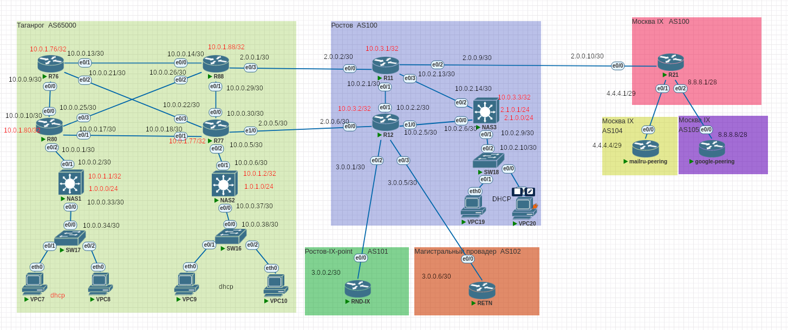

# Проектная работа. Тема: "Построение опорной сети регионального провайдера"

# Исходное домашнее задание:
- внешний вид сети(рассматриваемый в проектной работе созданный мною макет):


## Поставленные задачи
1. Планирование и распределение адресного пространства
2. Реализация статической маршрутизации на основе политик
3. Настройка VPN туннелей (статические и динамические) с шифрованием между удаленными офисами
4. Настройка протоколов маршрутизации (OSPF, EIGRP) внутри локальных сетей и поверх виртуальных каналов
5. Настройка протокола маршрутизации BGP внутри автономной системы и между ними
6. Шифрование VPN соединений
Настройка инфраструктурных сервисов (DHCP, NTP, NAT и т.п.)
План работы и изменения зафиксированы в документации.

Т. к. это не формат ДЗ, я сделал пока более кратко (и не всё). 

#### Базовая настройка устройств:

```
basic_commands.txt
```

#### Настройка OSPF: 

```
ospf_commands.txt
```
#### Настройка BGP 
```
bgp_commands.txt
```
#### Настройка BGP (фильтрация)
```
bgp_filtering.txt
```
#### Настройка протоколов "Интернет". (DHCP, NAT)

```
internet.txt
```

Пока сдал в таком виде для промежуточного контроля.

#### Конфигурации оборудования.
Готовые конфигурации оборудования были экспортированы в папку configs (zip архив, выгруженный из PnetLab. Так можно?)


