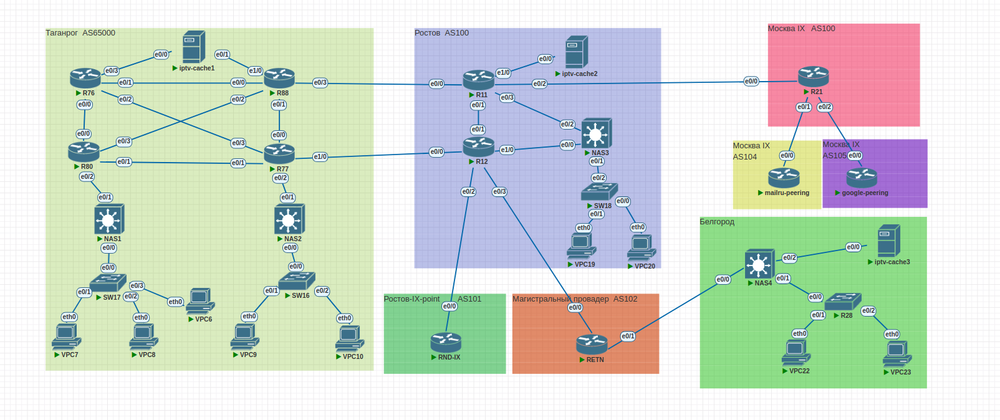
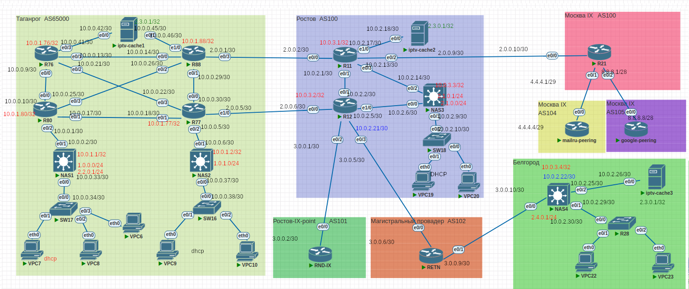

# Проектная работа. Тема: "Построение опорной сети регионального провайдера"

# Исходное домашнее задание:
- внешний вид сети(рассматриваемый в проектной работе созданный мною макет):

## Поставленные задачи
1. Планирование и распределение адресного пространства
2. Реализация статической маршрутизации на основе политик
3. Настройка VPN туннелей (статические и динамические) с шифрованием между удаленными офисами
4. Настройка протоколов маршрутизации (OSPF, EIGRP) внутри локальных сетей и поверх виртуальных каналов
5. Настройка протокола маршрутизации BGP внутри автономной системы и между ними
6. Шифрование VPN соединений
Настройка инфраструктурных сервисов (DHCP, NTP, NAT и т.п.)
План работы и изменения зафиксированы в документации.

####  Планирование и распределение адресного пространства

Распределение адресного пространства указано на рисунке ниже:

#### Базовая настройка устройств:

В документе ниже приведены команды для настройки базовых параметров устройств (ip адреса и др):

[Базовые настройки ](https://github.com/mastergt/otus_network_engineering/blob/master/project/basic_commands.txt).

Далее, у меня везде внутри сети (внутри каждой автономной системы) работает протокол OSPF. 
#### Настройка OSPF: 

[Настройки OSPF ](https://github.com/mastergt/otus_network_engineering/blob/master/project/ospf_commands.txt).

Далее, между AS, а также внутри локации "Ростов" - у меня поднят BGP.

#### Настройка BGP 

[Настройки BGP ](https://github.com/mastergt/otus_network_engineering/blob/master/project/bgp_commands.txt).

Т. к. я делал макет сети провайдера. который стыкуется на IX - куда уж без фильрации BGP: 

#### Настройка BGP (фильтрация)
[Настройки BGP фильтрации ](https://github.com/mastergt/otus_network_engineering/blob/master/project/bgp_filtering.txt).

Далее. У меня в сети присутствуют такие устройства как NAS - Network access server - сервер. который и выпускает абонентов в интернет. 
В моем случае NAS еализован на базе L3 cisco образа.

#### Настройка протоколов "Интернет". (DHCP, NAT)

[Настройки internet протоколов ](https://github.com/mastergt/otus_network_engineering/blob/master/project/internet.txt).

Вот для PBR я долго думал, куда бы его прикрутить ну и придумал на NAS1 сделать 2 разных пула адресов: 
1. Который за NAT, а абонентам выдаются "серые" адреса.
2. абоненты, которым выдаются "белые" IP.

И вот PBR реализовал так, что трафик от абонентов будет идти через роутер R76 (ну такая вот балансировка, почему бы и нет)

#### Настройка PBR 

[Настройка PBR ](https://github.com/mastergt/otus_network_engineering/blob/master/project/PBR_command.txt).

Далее - абсолютно реальный кейс: наш маленький провайдер купил обычный канал с выдеденным "белым" IP - и начал стройку своей сети в другой локации - в данном случае г. Белгород.
Что мы тут делаем: строим через этот выделенный канал GRE IPSec туннель и весь трафик с этой локации заворачиваем к себе в сеть, чтобы потом выпустить как и другой свой трафик.

#### Настройка GRE IPSec

[Настройка GRE IPSec ](https://github.com/mastergt/otus_network_engineering/blob/master/project/vpn_command.txt).

Все поставленные в проекте задачи я выполнил и готов приступить к формированию финальной презентации для защиты.

#### Конфигурации оборудования.
Готовые конфигурации оборудования были экспортированы в папку configs (zip архив - [project.zip ](https://github.com/mastergt/otus_network_engineering/blob/master/project/configs/project.zip), выгруженный из PnetLab. )

